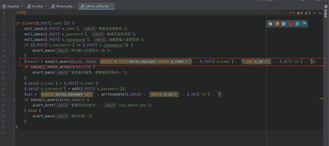
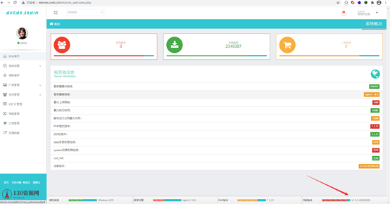
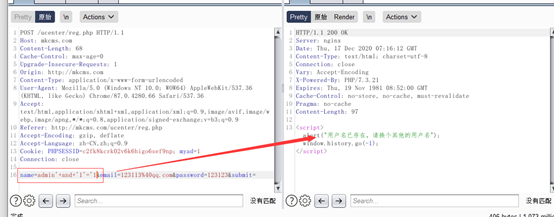
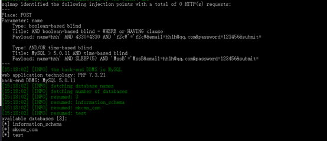
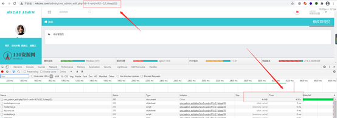

# MKCMS v7.0.3 sql注入漏洞审计

## 漏洞简介

米酷影视管理系统是一套专为不同需求的站长而设计的影视管理系统，灵活，方便，人性化设计简单易用是最大的特色，是快速架设视频网站首选，只需 3 分钟即可建立一个海量的视频讯息的行业网站。  
米酷CMS v7.0.3版本`admin/model/admin_edit.php`、`ucenter/reg.php`等文件存在漏洞，攻击者可以利用漏洞进行`sql`注入攻击。

## 漏洞影响

米酷CMS v7.0.3

## 第一处注入

*   **漏洞文件**

`ucenter/reg.php` （前台文件）

*   **分析**  
    在reg.php这个文件中，第9行处对`$username`这个参数进行了查询拼接，  
    

    但是在第7行处，`$username`的值是来自于`POST`传递的`name`参数，当`name`参数到达`reg.php`这个文件之后，`stripslashes（）`函数将`name`的值进行了去除“`\`”处理，  
      
根据`include`，跳转到`/system/library.php`中，我们可以发现这里系统对`GET`、`POST`等参数进行了`addslashes_deep（）`函数处理，即对参数传递时加上了一个“`\`”，  
      
    问题就出在这里，前端用户进行提交的`name`参数，经过了`addslashes_deep（）`函数处理加上了一个“`\`”，到达`reg.php`页面又使用`stripslashes（）`函数将`name`的值进行了去除“`\`”处理，这就导致出现了无过滤拼接。

## 第二处注入

*   **漏洞文件**  
    `admin/model/admin_edit.php`（后台文件）
    
*   **分析**  
    在`admin_edit.php`文件第10行处，系统进行了数据库查询，拼接了两个参数，一个是`POST`传递的`a_name`，一个是`GET`传递的`id`，可以看出，系统并未对参数在这里做任何的过滤处理，  
    

## 本地复现

*   **环境搭建**  
    由于需要设置伪静态，这里用的是宝塔面板  
    源码地址：[米酷CMS v7.0.3](https://pan.baidu.com/s/1ejCjLSVQEa1tFINVTPqfyA)，提取码：uy5u  
    （环境搭建教程在源码中附有）  
    搭建完成：  
    后台账号密码为`admin/admin`  
    
*   **第一处漏洞测试**  
    来到前台漏洞点，`http://mkcms.com/ucenter/reg.php`（`mkcms.com为本地静态`!)  
    抓包注册`admin`用户，提示已存在  
      
    在`name`参数处构造Payload：`+and+'1'='2`  
    

    在`name`参数处构造Payload：`+and+'1'='1`  
    

    根据不同的返回值可以说明构造的payload被拼接到数据库进行了判断处理.  
    使用sqlmap验证  
    

*   **第二处漏洞测试**  
    定位到漏洞点，url：`http://mkcms.com/admin/cms_admin_edit.php?id=1`（`mkcms.com为本地静态`!)  
      
    使用单引号进行判断  
      
    构造payload：`id=1+and+if(1>2,1,sleep(3))`  
      
    可以看到，数据库执行了`sleep（）`函数。

    直接丢到sqlmap进行注入  
    

## 参考

> https://blog.csdn.net/sjyyyyyyyy/article/details/111606650