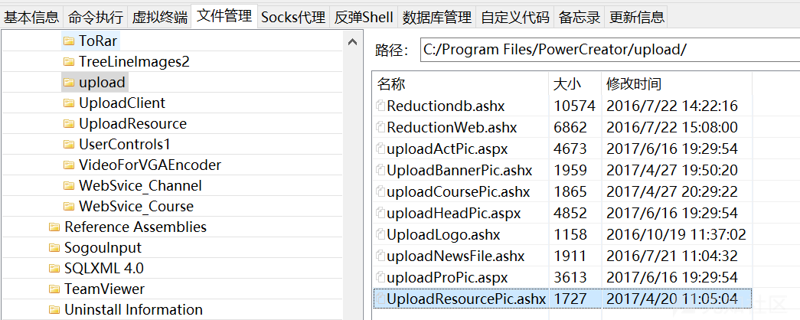
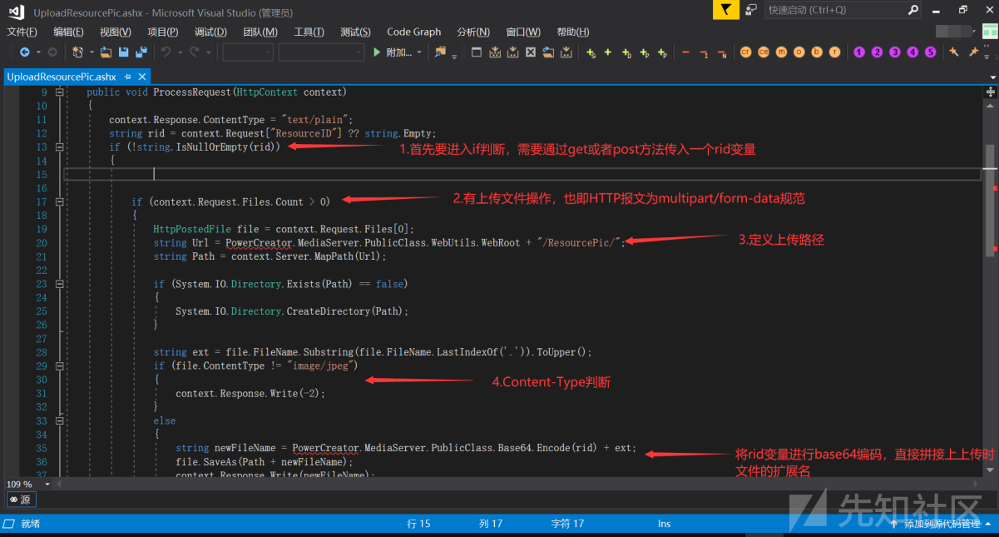
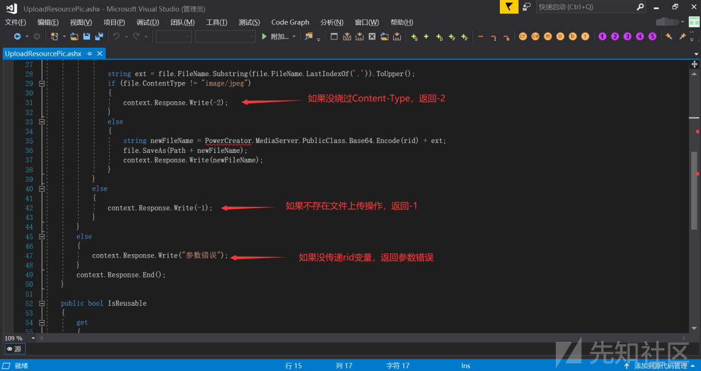
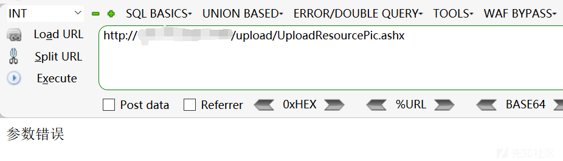
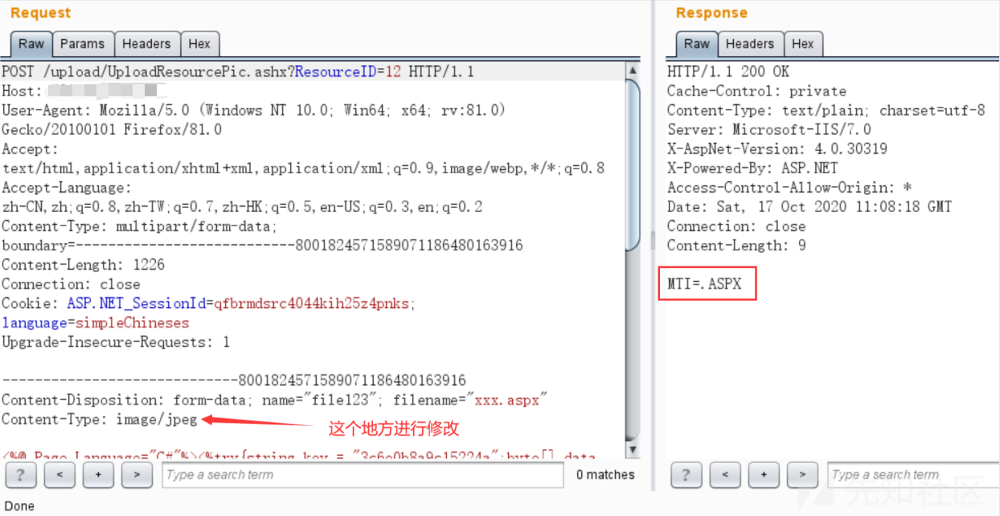
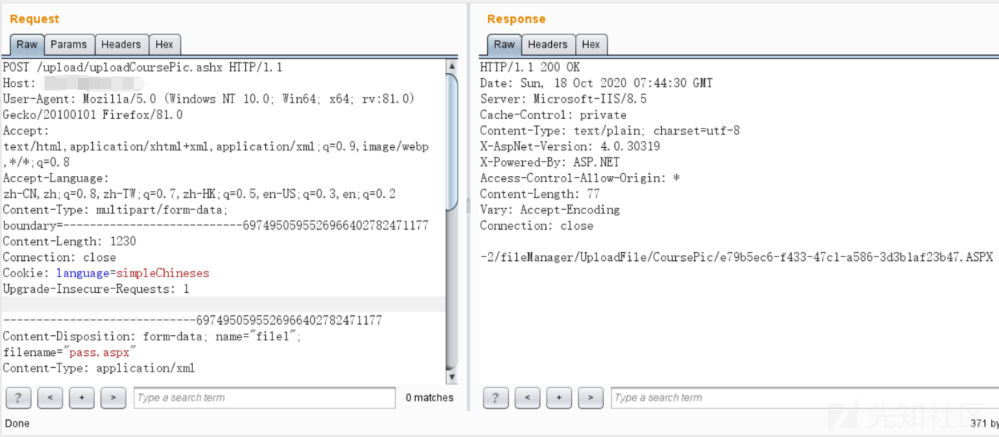
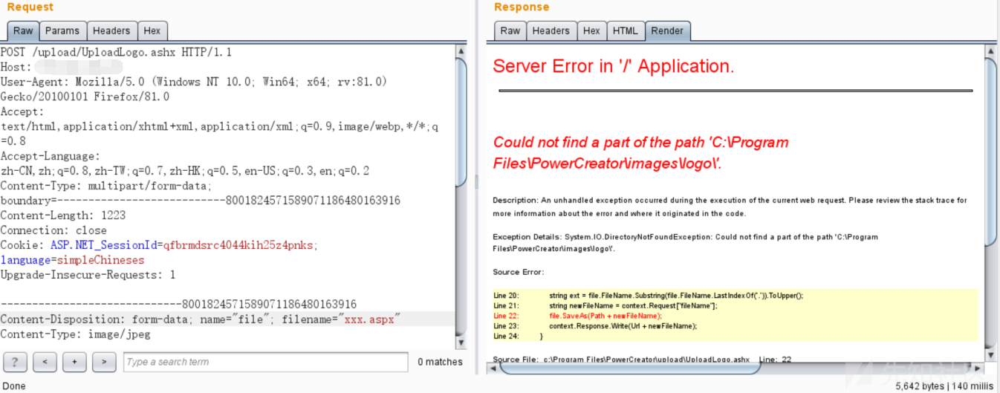

# PowerCreatorCms任意上传


## 编辑器任意文件上传

根据描述，是编辑器的漏洞，查看源码发现该CMS采用了kindeditor编辑器，该编辑器存在任意文件上传漏洞


因为这个是烂大街的东西，关于对`kindeditor`编辑器任意文件上传的分析文章网上一搜一大堆，因此这里就略了。另外经过复现发现，只能传`txt`和`html`，不能传`aspx`，很鸡肋。


## 任意文件上传漏洞

### UploadResourcePic.ashx

根据发现的两个shell，很明显shell的命名不是通过kindeditor编辑器上传的，一定是通过其他的方法上传上去的，那么我们来分析一下漏洞到底在哪呢？查找具有上传功能的点，发现了upload目录里全是上传功能文件



再结合第一个webshell路径：第一个shell：http://xxx.xxx.xxx.xxx./resourcePic/MQ==.ASPX
根据这个ResourcePic目录，发现是上传功能目录下UploadResourcePic.ashx这样一个文件上传后保存的位置，对其进行代码审计

```c#
<%@ WebHandler Language="C#" Class="UploadResourcePic" %>

using System;
using System.Web;

public class UploadResourcePic : IHttpHandler
{

    public void ProcessRequest(HttpContext context)
    {
        context.Response.ContentType = "text/plain";
        string rid = context.Request["ResourceID"] ?? string.Empty;
        if (!string.IsNullOrEmpty(rid))
        {


            if (context.Request.Files.Count > 0)
            {
                HttpPostedFile file = context.Request.Files[0];
                string Url = PowerCreator.MediaServer.PublicClass.WebUtils.WebRoot + "./resourcePic/";
                string Path = context.Server.MapPath(Url);

                if (System.IO.Directory.Exists(Path) == false)
                {
                    System.IO.Directory.CreateDirectory(Path);
                }

                string ext = file.FileName.Substring(file.FileName.LastIndexOf('.')).ToUpper();
                if (file.ContentType != "image/jpeg")
                {
                    context.Response.Write(-2);
                }
                else
                {
                    string newFileName = PowerCreator.MediaServer.PublicClass.Base64.Encode(rid) + ext;
                    file.SaveAs(Path + newFileName);
                    context.Response.Write(newFileName);
                }
            }
            else
            {
                context.Response.Write(-1);
            }
        }
        else
        {
            context.Response.Write("参数错误");
        }
        context.Response.End();
    }

    public bool IsReusable
    {
        get
        {
            return false;
        }
    }

}
```

代码逻辑及漏洞如图所示：





根据上面的分析，其实漏洞的关键点就是上传接口未授权访问可以直接进行上传操作，存在一个Content-Type为image/jpeg的判断，另外需要注意的是传递一个ResourceID变量才能成功进入到上传逻辑。

直接访问，没传递rid变量，回显参数错误，因此上传接口前面没有任何校验，可以直接进行文件上传操作



给rid变量赋个值，也即任意使用get方法或者post方法传递ResourceID变量，但是由于不存在文件上传操作，报文类型不符合multipart/form-data规范，因此返回-1


那么只要本地构造一个上传表单，在上传的时候将Content-Type改成image/jpeg，就可以进行任意文件上传，上传过后文件命会是ResourceID变量的值进行base64编码+上传文件的扩展名

本地构造表单

```html
<form action="http://xxx.xxx.xxx.xxx/upload/UploadResourcePic.ashx?ResourceID=1" enctype="multipart/form-data" method="POST">
<input type="file" class="file1" name="file1" />
<button type="submit" class="but1">上传</button>
</form>
```

改一个Content-Type为image/jpeg，即可成功getshell



### uploadCoursePic.ashx

接下来还有一个webshell，http://xxx.xxx.xxx.xxx/fileManager/UploadFile/CoursePic/485b1b71-8035-44c1-9ceb-637cd68eda19.ASPX

```c#
<%@ WebHandler Language="C#" Class="uploadCoursePic" %>

using System;
using System.Web;

public class uploadCoursePic : IHttpHandler
{

    public void ProcessRequest(HttpContext context)
    {
        context.Response.ContentType = "text/plain";

        string delFileName = context.Request["fileName"];
        string CourseID = context.Request["CourseID"];
        if (!string.IsNullOrEmpty(CourseID))
        {
            if (delFileName == new PowerCreator.MediaServer.Course.Logic.Course().Load(int.Parse(CourseID)).PicPath)
                delFileName = "";
        }
        if (!string.IsNullOrEmpty(delFileName))
        {
            try
            {
                System.IO.File.Delete(context.Server.MapPath(delFileName));
            }
            catch (Exception e) { }
        }
        if (context.Request.Files.Count > 0)
        {
            HttpPostedFile file = context.Request.Files[0];
            string Url = PowerCreator.MediaServer.PublicClass.WebUtils.WebRoot + "/fileManager/UploadFile/CoursePic/";
            string Path = context.Server.MapPath(Url);

            if (System.IO.Directory.Exists(Path) == false)
            {
                System.IO.Directory.CreateDirectory(Path);
            }

            string ext = file.FileName.Substring(file.FileName.LastIndexOf('.')).ToUpper();
            if (!".PNG.JPG".Contains(ext))
            {
                context.Response.Write(-2);
            }
            string newFileName = Guid.NewGuid().ToString() + ext;
            file.SaveAs(Path + newFileName);
            context.Response.Write(Url + newFileName);
        }
        else
        {
            context.Response.Write(-1);
        }
    }

    public bool IsReusable
    {
        get
        {
            return false;
        }
    }

}
```

前面一部分代码做了一个文件删除的操作，没什么用，重点在28行开始，分析如下：


漏洞原因在于：如果没有通过扩展名为图片的判断的话，会返回-2，但是返回以后程序并没有退出或跳过文件上传操作，依然进行了文件上传操作。我真是没想明白，开发做了这一步判断的目的是什么。。。。。。。。

那么payload的构造就很简单了，直接对着uploadCoursePic.ashx接口发一个multipart/form-data规范报文，无需任何绕过



返回了一个-2，紧接着跟着了成功上传的webshell的地址，和我们分析的预期一模一样

### UploadLogo.ashx

本来分析应该到此为止了的，正好作为一个合格的划水的蓝方，闲着也是闲着，不如把其他上传接口也一并看一遍吧，UploadLogo.ashx，代码如下：

```c#
<%@ WebHandler Language="C#" Class="UploadLogo" %>

using System;
using System.Web;

public class UploadLogo : IHttpHandler {

    public void ProcessRequest (HttpContext context) {
        context.Response.ContentType = "text/plain";
        if (context.Request.Files.Count > 0)
        {
            HttpPostedFile file = context.Request.Files[0];
            string Url = PowerCreator.MediaServer.PublicClass.WebUtils.WebRoot + "/images/logo/";
            string Path = context.Server.MapPath(Url);

            if (System.IO.Directory.Exists(Path) == false)
            {
                System.IO.Directory.CreateDirectory(Path);
            }
            string ext = file.FileName.Substring(file.FileName.LastIndexOf('.')).ToUpper();
            string newFileName = context.Request["fileName"];
            file.SaveAs(Path + newFileName);
            context.Response.Write(Url + newFileName);
        }
        else
        {
            context.Response.Write(-1);
        }
        context.Response.End();
    }

    public bool IsReusable {
        get {
            return false;
        }
    }

}
```


文件会传到logo目录，如图


如果不赋值fileName变量会报错，如图



只要在上传的时候通过get或者post给fileName赋值即可，payload如下


### uploadActPic.aspx不存在漏洞

其实其他几个文件都不存在任意文件上传漏洞了，这里就不再赘述，但是uploadActPic.aspx这个文件比较特殊，里面全是HTML代码，真正的代码通过父类来引入，在dll中，分析过程如下:


哥斯拉导出bin目录


使用dnspy反编译dll文件，uploadActPic方法在LMS_MediaServer.dll这个文件里，查看逻辑使用白名单校验，不存在任意文件上传


至此，代码审计结束

## 文章来源

> https://xz.aliyun.com/t/8478